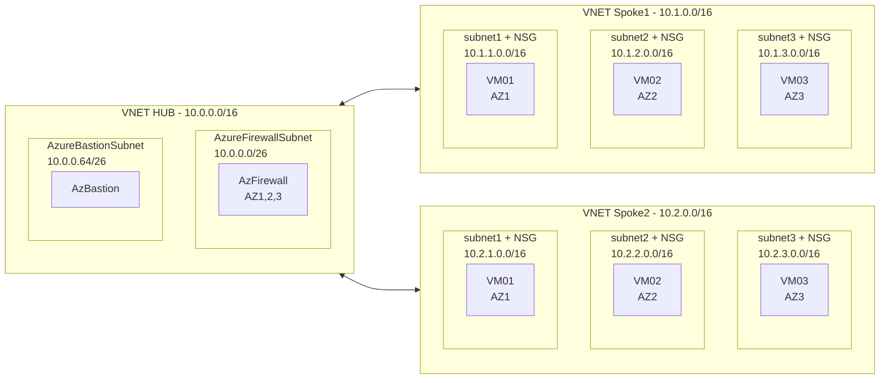

# Azure-NetworkLatencyLAB
Azure-NetworkLatencyLAB

## Azure Network Topology

```mermaid
graph LR
subgraph spoke1 [VNET Spoke1 - 10.1.0.0/16]
    subgraph subnetA3 [subnet3 + NSG
    10.1.3.0.0/16]
    direction TB
    VMA3[VM03
    AZ3]    
    end    
    subgraph subnetA2 [subnet2 + NSG
    10.1.2.0.0/16]
    direction TB
    VMA2[VM02
    AZ2]    
    end    
    subgraph subnetA1 [subnet1 + NSG
    10.1.1.0.0/16]
    direction TB
    VMA1[VM01
    AZ1]
    end
    end
subgraph spoke2 [VNET Spoke2 - 10.2.0.0/16]
    subgraph subnetB3 [subnet3 + NSG
    10.2.3.0.0/16]
    direction TB
    VMB3[VM03
    AZ3]    
    end    
    subgraph subnetB2 [subnet2 + NSG
    10.2.2.0.0/16]
    direction TB
    VMB2[VM02
    AZ2]    
    end    
    subgraph subnetB1 [subnet1 + NSG
    10.2.1.0.0/16]
    direction TB
    VMB1[VM01
    AZ1]
    end
    end
subgraph hub [VNET HUB - 10.0.0.0/16]
    subgraph SubnetHub1 [AzureFirewallSubnet
    10.0.0.0/26]
    direction TB
    AzFW[AzFirewall
    AZ1,2,3]
    end
    subgraph SubnetHub2 [AzureBastionSubnet 
    10.0.0.64/26]
    direction TB
    Bastion[AzBastion]
    end
    end
hub <---> spoke1
hub <---> spoke2
```